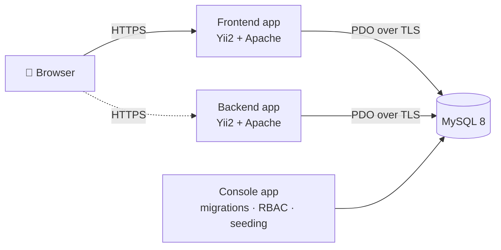

<p align="center">
  
</p>

<h1 align="center">BlumenHof · Florist Management Platform</h1>

<p align="center">
  <b>Fresh flowers · Smart management · COSD project</b><br>
  A web platform that helps a florist business manage customers, orders, products, stock and staff access in one place.
</p>

<p align="center">
  <a href="https://blumenhof-shop.onrender.com"></a>
</p>

<p align="center">
  
  
  
  
  
  
</p>

---

## 🌷 About the Project

**BlumenHof** is a fictional florist and garden-goods business. Like many small businesses, it used to run on emails, spreadsheets and paper: customer details in one place, orders in another, stock counted by hand.

This project replaces that with a single web platform where the team can:

- keep track of **business customers and contacts**,
- manage the **product catalog and stock levels**,
- create and follow **orders** from creation to delivery,
- and control **who can see and change what**, based on each employee's role.

The application is built on the **Yii2 Advanced Template** and is deployed live using Docker.

> **Live demo:** [blumenhof-shop.onrender.com](https://blumenhof-shop.onrender.com)
> The free hosting plan sleeps after inactivity, so the first visit can take up to a minute to load.

---

## ✨ Features

| Module | What it does |
|---|---|
| 👥 **CRM** | Manage customer companies (hotels, event planners, corporate clients) and their contact persons, grouped by customer category |
| 💐 **Catalog** | Products and product categories, prices, perishable flag and product images |
| 📦 **Stock** | Stock quantities per product with **low-stock warnings** when a threshold is reached |
| 🧾 **Orders** | Orders with multiple items, status tracking and delivery dates, linked to customers |
| 🔐 **Access control** | Role-based access (RBAC): every role only sees the modules it needs |
| 👤 **Accounts** | Sign up, login, password reset and email verification |
| 🏠 **Public pages** | Home, About Us, Contact and Impressum |

---

## 🔐 Roles & Permissions

Access is controlled with Yii's database-backed RBAC (`DbManager`). Each module has a **view** and a **manage** permission, where *manage* includes *view*.

| Role | Access |
|---|---|
| `guest` | Default role for new sign-ups, no module access until a role is assigned |
| `salesEmployee` | Manage **Orders**, view **Catalog** and **Production** |
| `financialEmployee` | Manage **Finance**, view **Orders**, download reports |
| `inventoryEmployee` | Manage **Catalog** and **Production** |
| `manager` | Everything the three employee roles can do, plus manage **CRM** and **Dashboard**, view **Finance** |
| `owner` | View **every** module and download reports (read-only) |
| `admin` | Manage system users |

---

## 🏗️ Architecture



The project follows the Yii2 **three-tier** structure:

| Folder | Purpose |
|---|---|
| `frontend/` | The main BlumenHof application: public pages and all business modules |
| `backend/` | Separate admin application (basic admin panel) |
| `console/` | Command-line tools: migrations, RBAC setup and demo data seeding |
| `common/` | Shared models (User, Order, Product, CustomerCompany, ...) and configuration |
| `environments/` | Environment-specific configuration for development and production |

---

## 🚀 Getting Started (Local Development)

### Requirements
- Docker and Docker Compose
- Git

### 1. Clone and start the containers
```bash
git clone https://github.com/Jatin1Mathur/blumenhof-web-app.git
cd blumenhof-web-app
docker compose up -d --build
```

### 2. Install dependencies and initialize
```bash
docker compose exec frontend composer install
docker compose exec frontend php /app/init --env=Development --overwrite=All
```

### 3. Point the app to the Docker database
In `common/config/main-local.php`, set the database connection to the `mysql` service:
```php
'db' => [
    'class' => \yii\db\Connection::class,
    'dsn' => 'mysql:host=mysql;dbname=yii2advanced',
    'username' => 'yii2advanced',
    'password' => 'secret',
    'charset' => 'utf8',
],
```

### 4. Create tables, roles and the admin account
```bash
docker compose exec frontend php /app/yii migrate --migrationPath=@yii/rbac/migrations --interactive=0
docker compose exec frontend php /app/yii migrate --interactive=0
docker compose exec frontend php /app/yii rbac/init
docker compose exec frontend php /app/yii rbac/add-guest
docker compose exec frontend php /app/yii rbac/seed-admin
```

### 5. (Optional) Load demo data
Adds sample product categories, products, customers, stock and orders:
```bash
docker compose exec frontend php /app/yii seed/demo
```

### 6. Open the app
| App | URL |
|---|---|
| Frontend (BlumenHof) | http://127.0.0.1:20080 |
| Backend (admin) | http://127.0.0.1:21080 |

---

## 🛠️ Console Commands

| Command | Description |
|---|---|
| `php yii migrate` | Create or update all database tables |
| `php yii rbac/init` | Create all roles and permissions (run once) |
| `php yii rbac/add-guest` | Create the `guest` role for new sign-ups (safe to re-run) |
| `php yii rbac/seed-admin` | Create the protected admin account and assign the `admin` role (safe to re-run) |
| `php yii seed/demo` | Load realistic florist demo data |

> ⚠️ The admin account's initial credentials are defined in `console/controllers/RbacController.php`.
> **Change the password after the first login**, especially on a public deployment.

---

## ☁️ Deployment

The live version runs on free cloud services:

| Part | Service |
|---|---|
| Web app (Docker) | [Render](https://render.com), region Frankfurt |
| Database | [Aiven](https://aiven.io) MySQL, Europe, TLS required |

The root `Dockerfile` builds a production image: it installs dependencies, initializes the **Production** environment, creates the runtime folders, and on every start runs the migrations, RBAC setup and admin seeding before launching Apache. The build argument `APP` selects which application is served (`frontend` or `backend`).

Database settings are read from **environment variables**, so no passwords are stored in the code:

| Variable | Example | Purpose |
|---|---|---|
| `DB_HOST` | `your-db.aivencloud.com` | Database host |
| `DB_PORT` | `28522` | Database port |
| `DB_NAME` | `defaultdb` | Database name |
| `DB_USER` | `avnadmin` | Database user |
| `DB_PASSWORD` | *(secret)* | Database password |
| `DB_SSL_CA` | `/app/ca.pem` | CA certificate for the TLS connection |
| `PORT` | `80` | Port Apache listens on |
| `APP` | `frontend` | App to serve: `frontend` or `backend` |

---

## 🧪 Testing

Tests are written with [Codeception](https://codeception.com/) and live in `frontend/tests`, `backend/tests` and `common/tests`.

```bash
vendor/bin/codecept run
```

> Use a **separate test database**. The test suite clears the `user` table, so running it against the real database removes all accounts (`php yii rbac/seed-admin` restores the admin account).

---

## 👤 Maintainer

**Jatin Mathur**, Master's student at **Hof University of Applied Sciences**

- Production Docker setup, cloud deployment (Render + Aiven) and environment-based configuration
- RBAC and admin setup on the live system
- Project documentation

[](https://github.com/Jatin1Mathur)

Originally developed as a course project for **COSD** at Hof University, organized with Scrum and tracked in Jira (`FLR` tickets).

---

## 📄 License

Based on the [Yii 2 Advanced Project Template](https://github.com/yiisoft/yii2-app-advanced), licensed under the **BSD-3-Clause** license. See [LICENSE.md](LICENSE.md).
